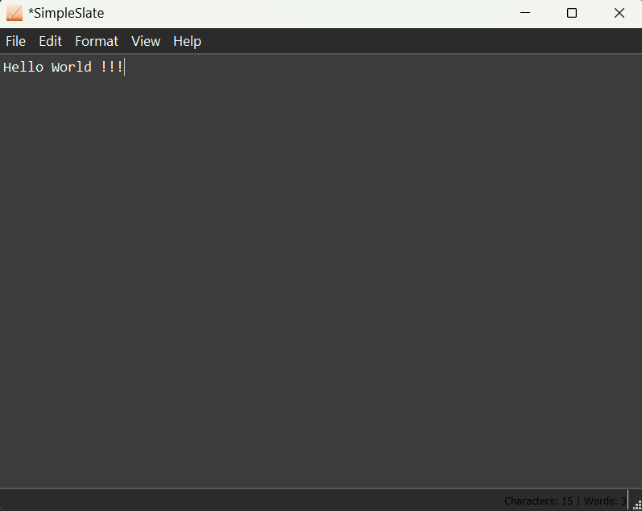
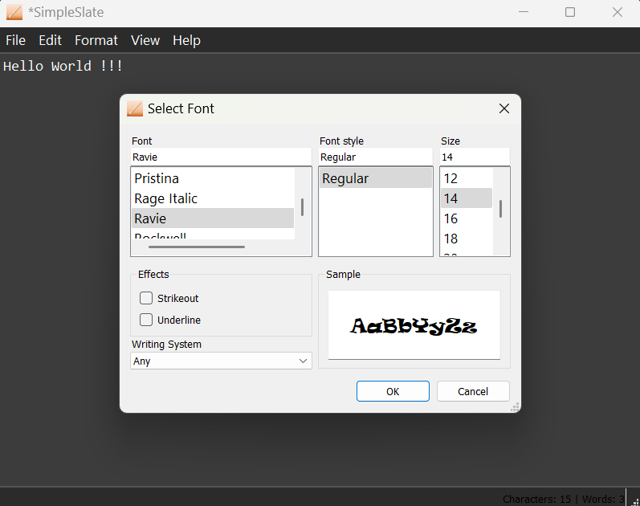
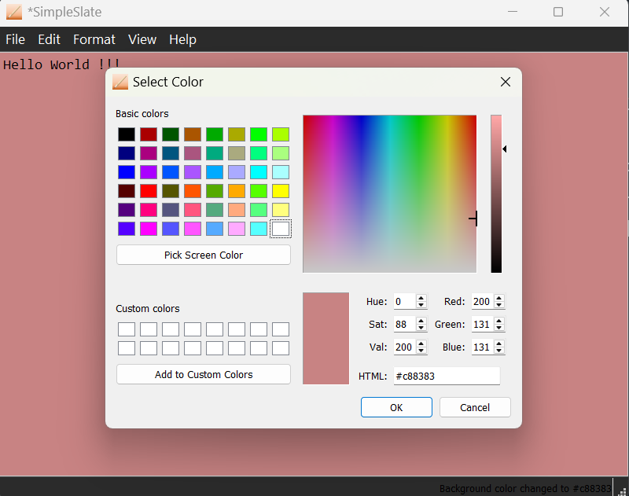

---
### SimpleSlate - A Lightweight Modern Text Editor

SimpleSlate is a sleek and minimalist **text editor** built with **Python and PyQt5**. Designed for simplicity and productivity, it mimics the classic Notepad experience but adds essential features like font customization, color pickers, and printing support — all wrapped in a clean GUI.

SimpleSlate is available as:
- ✅ `.py` script (cross-platform)
- ✅ `.exe` installer for Windows

---

## ✨ Features

| Feature                        | Description                                                                 |
|-------------------------------|-----------------------------------------------------------------------------|
| 📁 **Create/Open/Save Files** | Supports creating new files and opening `.txt` files to edit or read.       |
| 💾 **Persistent Save Logic**  | Text written and saved is correctly retained when re-opened.               |
| 🖨️ **Print Functionality**    | Easily print your documents with the integrated print preview dialog.      |
| 🎨 **Font & Color Customization** | Select font style, color, size, and change text or background color.           |
| 🖼️ **Custom Icons & UI**      | Clean and user-friendly interface built with PyQt5 and icons.              |
| 🛠️ **Cross-Platform**         | Works on Windows, Linux, and macOS with Python; bundled `.exe` for Windows.|
| 🌓 **Light/Dark Mode**        | Supports light and Dark mode switching.                                    |

---

## 🔧 Installation & Usage

### 💻 For All Platforms (.py)

1. **Clone the Repository**

```bash
   git clone https://github.com/yottajunaid/SimpleSlate.git
   cd SimpleSlate
````

2. **Install Dependencies**

   ```bash
   pip install PyQt5
   ```

3. **Run the Application**

   ```bash
   python simpleslate.py
   ```

---
### 🪟 For Windows Users (.exe)

1. Download the latest `SimpleSlate.exe` from the [Releases](#) section.
2. Install it on your system.
3. Launch SimpleSlate from your Desktop or Start Menu.
4. Use it just like Notepad — but with more control and customization.

---

## 🖼️ Screenshots

> Place your screenshots inside a `screenshots/` folder in the root directory.

| Editor View                 | Font Dialog                      | Background Color Picker           |
| --------------------------- | -------------------------------- | --------------------------------- |
|  |  |  |

---

## 🎯 How to Use

### 🗂️ File Operations

* **New File** – Start from a blank document.
* **Open File** – Load existing `.txt` files.
* **Save File** – Save current text to disk.
* **Print File** – Opens a dialog to print via system printer.

### 🎨 Customization

* **Fonts** – Select from system fonts and apply different styles/sizes.
* **Text Color** – Choose a color for your text using a color dialog.
* **Background Color** – Change the editor's background color.

### 💬 Status Bar

* The app shows a status message when files are created, opened, or saved.
---

## 🧪 Compatibility

| Platform       | Status         |
| -------------- | -------------- |
| Windows (.exe) | ✅ Full Support |
| Windows (.py)  | ✅ Full Support |
| Linux          | ✅ Full Support |
| macOS          | ✅ Full Support |

---

## 📄 License

This project is licensed under the **MIT License**.
You are free to use, modify, and distribute this software as you wish.

---

## 🤝 Contributing

Contributions are welcome!

* 🐛 Found a bug? Open an [issue](https://github.com/yottajunaid/simpleslate/issues).
* 🌟 Want a new feature? Submit a pull request or start a discussion.
* 💻 Developers: Follow PEP8 and use clear commit messages.

---

## 📬 Author & Contact

**Developed by:** \[YOTTAJUNAID]
GitHub: [@yottajunaid](https://github.com/yottajunaid)
LinkedIn: [@junaidquadri](https://www.linkedin.com/in/junaid-quadri-084279241/)
Tools Used: PyQt5, Pycharm, Pyinstaller, Claude.

---

## 📌 Notes

* Ensure PyQt5 is installed in your environment to run the `.py` version.
* If fonts/colors appear buggy on Linux, try using a standard theme.

---


